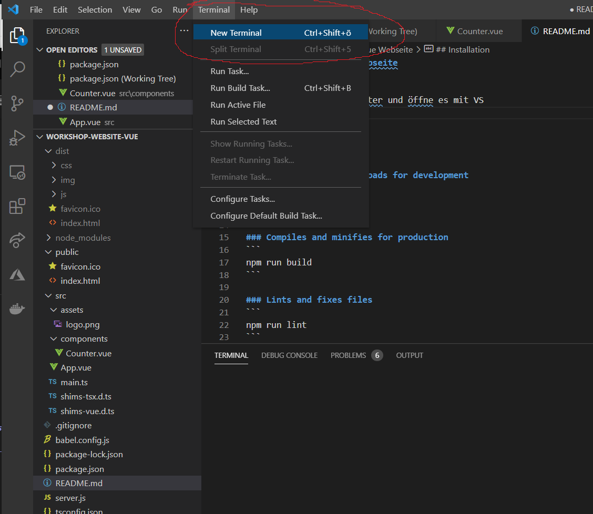
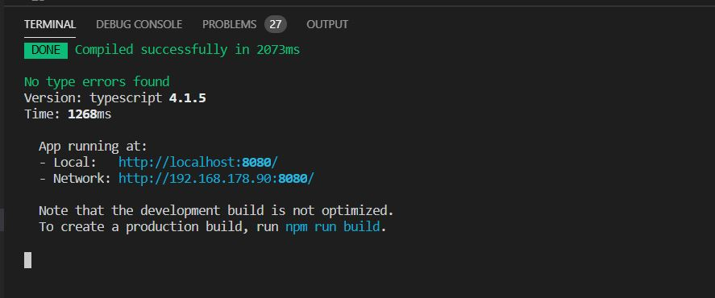

# Beispielprojekt Vue Webseite

## Installation
- Lade das Projekt herunter und öffne es mit VS
- öffne ein Terminal über Terminal -> New Terminal

- führe folgenden Befehl aus:

```
npm install
```

warte einen Moment ;)

## Webseite starten
Nachdem du alles installiert hast, tippe im Terminal folgenden Befehl
```
npm run serve
```

sobald du grüne Schrift siehst, kannst du deinen Browser öffnen und auf http://localhost:8080/ deine webseite sehen. Du kannst auch einfach den Link hinter "Local:" mit strg + click öffnen. 



Sobald du den Code in VS änderst und dateien speicherst, sollte sich die Webseite automatisch neuladen und du kannst deine Änderungen sofort sehen.
